# 🍻 NeighBrew - 취향 맞는 술 모임과 다양한 주종 정보를 한 자리에서

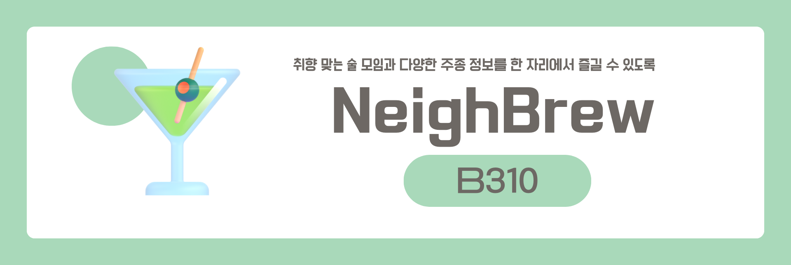

## NeighBrew 링크(모바일에 최적화 되어있습니다)   : [NeighBrew](https://i9b310.p.ssafy.io/)

## 소개 영상 보기 : [UCC 링크](https://youtu.be/UZKUr7McmJw)

## 🥃 프로젝트 진행 기간

2023.07.04(화) ~ 2023.08.18(금)
 
SSAFY 9기 2학기 공통 프로젝트

 

## 🍺 NeighBrew - 배경

다양한 주종은 접해보고 싶은데, 술에 대한 정보가 없어 포기하신 적이 있으시지 않으신가요?

술 행사 관련 정보를 찾기 어렵지 않으셨나요?

혹은, 특정 한 술을 마셔보고 싶지만 함께 먹을 사람이 없어 포기하시지 않으셨나요?

음주에 대한 취향과 취미를 포기하지 않고 이어나가고 싶은 당신을 위해 준비했습니다.

 

## 🍹 NeighBrew - 개요

_- 취향 맞는 술 모임과 다양한 주종 정보를 한 자리에서 즐길 수 있도록 -_

**NeighBrew**은 당신의 음주 취향에 맞는 사람들과 모임을 조성하고 이를 통해 주종에 대한 이해 및 취미 생활을 독려하는 SNS 플랫폼 입니다.

양주와 와인과 같은 즐기는 주종에 대한 시장은 최근 3년간 폭발적으로 성장하고 있습니다.
 하지만 성장해가는 시장에 맞는 플랫폼의 부재로 사용자들은 **스스로 모임을 모집** 및 **흩어져있는 정보를 수집** 하며 취미 생활을 이어나가고 있습니다.

저희는 이러한 문제점을 해소하고 다양한 술에 대한 정보를 객관적 ,주관적 (후기) 데이터를 제공하며 취향 맞는 사람들과의 모임을 가능하게 합니다.

또한, 평소 찾기 힘들었던 술관련 행사도 한 눈에 확인 할 수 있어 취미생활을 이어나갈 수는 환경을 제공합니다.

 
뿐만 아니라 자신이 경험한 술들은 자신의 술장에 들어가 자신이 경험한 술을 영원히 기억할 수 있습니다.

## 🍷 주요 기능

## 술장

- 최상단 음주 관련 행사 배너를 출력합니다
  - "시음행사", "주류 박람회", "양조장 투어" 등 행사 정보를 출력함으로 취미 생활을 이어나갈 수 있도록 독려 합니다.
- 중단에 서비스가 현재 제공하고 있는 술을 보여줍니다.
  - 후기를 남기고(보고) 싶은 술을 검색하여 해당 술에 대한 여러 유저의 주관적, 객관적 데이터를 수집할 수 있습니다.
- 하단에 현재 가장 인기있는 후기들을 보여줍니다.
  - 현재 유저들 사이에서 인기 있는 주종을 알 수 있으며 다양한 유저와 소통 할 수 있는 장을 제공합니다.
     

## 취향에 맞는 모임 조성

- 원하는 술에 대한 모임을 생성 및 참여 가능
  - 선호하는 연령, 간수치(매너지수), 인원, 장소, 시간 설정으로 맞춤 모임을 생성 및 참여가 가능합니다.
- 참여 신청
  - 자신이 원하는 모임을 발견 시 참여 신청이 가능합니다.
  - 방장은 들어온 신청을 보고 수락 및 거절이 가능합니다.
  - 모임에 참여하게 되면 단체 채팅방이 생성되어 모임 전까지 그라운드룰, 세부 정보 등을 공유할 수 있습니다.
     

## 마이 페이지(유저 페이지)

- 유저의 간수치(메너수치), 술병(자신의 경험한 술)을 확인 할 수 있습니다
- 유저의 팔로워/ 팔로잉 유저들을 확인 할 수 있습니다.
- 악성유저의 경우 신고기능을 제공합니다
- 유저와 관련된 모임들을 한 번에 확인 가능합니다
- 유저가 경험했던 술을 한 눈에 확인 할 수 있습니다.
  - 술을 모집하는 경험을 통해 재미요소를 추가할 예정입니다.
  - 해당 기능을 통해 해당 유저의 취향을 확인 할 수 있습니다.
- DM 기능을 통해 취향 맞는 사람과의 소통을 도모합니다.
   

## ✔ 주요 기술

**Backend - Springboot**

- IntelliJ
- MySQL DB
- Spring Boot
- stomp
- OAuth API (kakao, google, naver)
- JPA

**Frontend**
- Node(18.X.X) LTS
- Vite : 4.4.0
- vite-plugin-pwa : 0.16.4
- React : 18.2.0
- Typescript : 5.0.2
- @formkit/auto-animate : 0.7.0,
- @stomp/stompjs : 7.0.0,
- axios : 1.4.0,
- react-dom : 18.2.0,
- react-modal : 3.16.1,
- react-router-dom : 6.14.1,
- react-slick : 0.29.0,
- react-textarea-autosize : 8.5.2,
- slick-carousel : 1.8.1,
- sockjs-client : 1.6.1,
- styled-components : 6.0.4,
- react-tooltip : 5.20.0
- browser-image-compression : 2.0.2
- react-swipeable-list : 1.9.1

**Environment**

- AWS EC2
- NGINX
- SSL
- Docker

## ✔ 협업 툴

---

- Gitlab
- Notion
- JIRA
- MatterMost
- POSTMan
- GitMInd
- Canva

## ✔ 협업 환경

- Gitlab
  - 코드 버전 관리
  - 이슈 발행, 해결을 위한 토론
  - MR시, 팀원이 코드리뷰를 진행하고 피드백 게시
- JIRA
  - 매주 목표량을 설정하여 Sprint 진행
  - 업무의 할당량을 정하여 Story Point를 설정하고, In-Progress -> Done 순으로 작업
  - 소멸 차트를 통해 프로젝트 진행도 확인
- 회의
  - 각자 위치에서 건네야 할 말이 생기면 팀원의 위치로 이동하여 전달
  - 빠른 소통과 신속한 대응 가능
- Notion

  - 회의가 있을때마다 회의록을 기록하여 보관
  - 회의가 길어지지 않도록 다음날 제시할 안건을 미리 기록
  - 기술확보 시, 다른 팀원들도 추후 따라할 수 있도록 보기 쉽게 작업 순서대로 정리
  - 컨벤션 정리
  - 간트차트 관리
  - 스토리보드, 스퀀스다이어그램, 기능명세서 등 모두가 공유해야 하는 문서 관리

- POSTMan
  - POSTMan 이용해 필요한 API 테스트 및 실행
  - API 변동 사항을 한눈에 볼 수 있으며, 인수 또는 반환값 스키마를 제공

## ✔ 팀원 역할 분배

s
## 👪  팀 소개

|  |   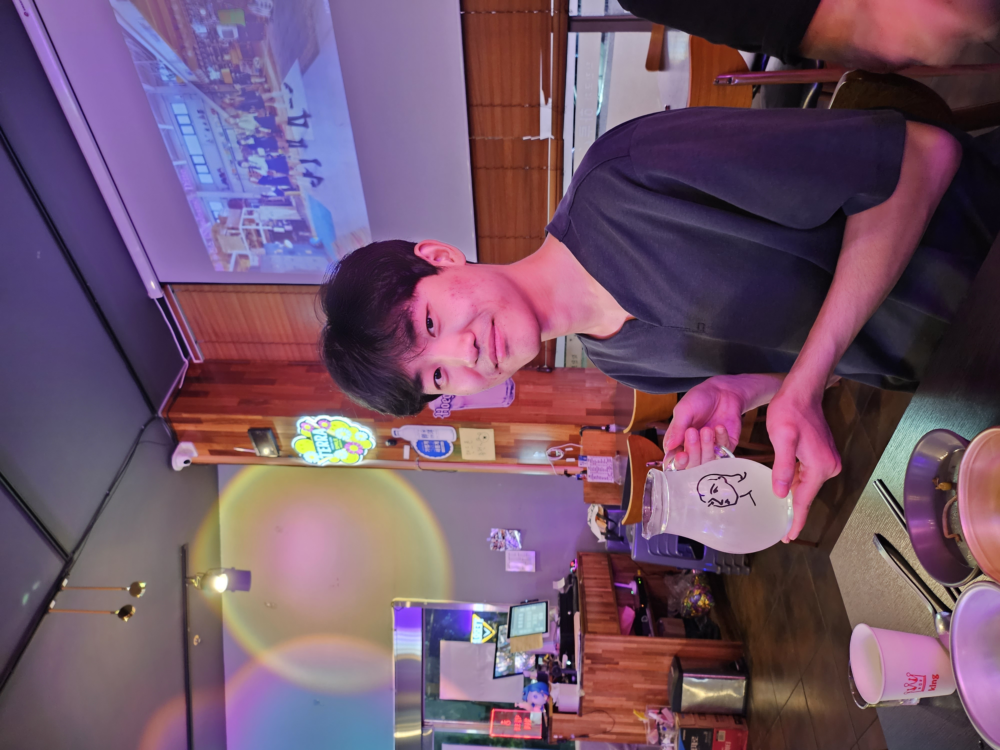    |              
|:----------------------------------------------------------------------------:|:-------------------------------------------------------:|:------------------------------------------------------------:|
|              [이현욱](https://github.com/Devwooki) 팀장 : BE 개발               | [인영교](https://github.com/yeongkyo1997)   BE 개발 및 배포 |     [최준서](https://github.com/wnstj7788)    BE 개발 및 기획    |
|                          |    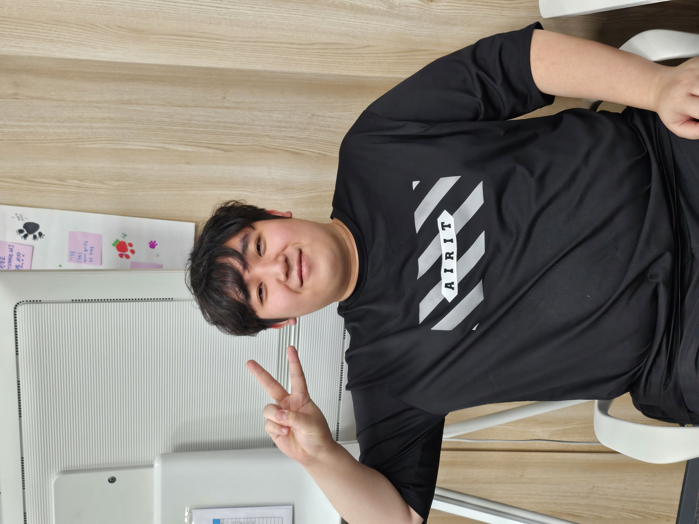    |              
|                [이다영](https://github.com/dayoung100)    FE 개발  및 디자인      |          [강동혁](https://github.com/ztarhyuk127)     FE 개발       |      [여현빈](https://github.com/godzz733)      FE 개발       |

  

<!-- 자유 양식 -->

## 프로젝트 상세 설명

 개발 환경, 기술 스택, 시스템 구성도, ERD, 기능 상세 설명 등

## ✔ **Git 커밋 메시지 컨벤션**

- `Feat` : 새로운 기능 추가
- `Modify` : 기존 기능 수정
- `Fix` : 버그 수정
- `Docs` : 문서 내용 변경
- `Style` : 포맷, 세미콜론 수정 등 코드가 아닌 스타일에 관련된 수정
- `Refactor` : 코드 리팩토링
- `Test`: 테스트 코드 추가 및 리팩토링 테스트 등
- `Build` : 빌드 관련 파일 수정
- `Chore` : 코드 의미에 영향을 주지 않는 변경사항 (포맷, 세미콜론 누락, 공백 등)
- `CI` : CI 관련 설정 수정에 대한 커밋
- 커밋 타입은 **대문자**로 시작하며, 항상 대괄호 안에 파트를 입력하여 시작
- 관련된 지라 이슈 번호에 괄호를 붙여 뒤에 추가.

 

## ✔ **Git 브랜치 컨벤션**

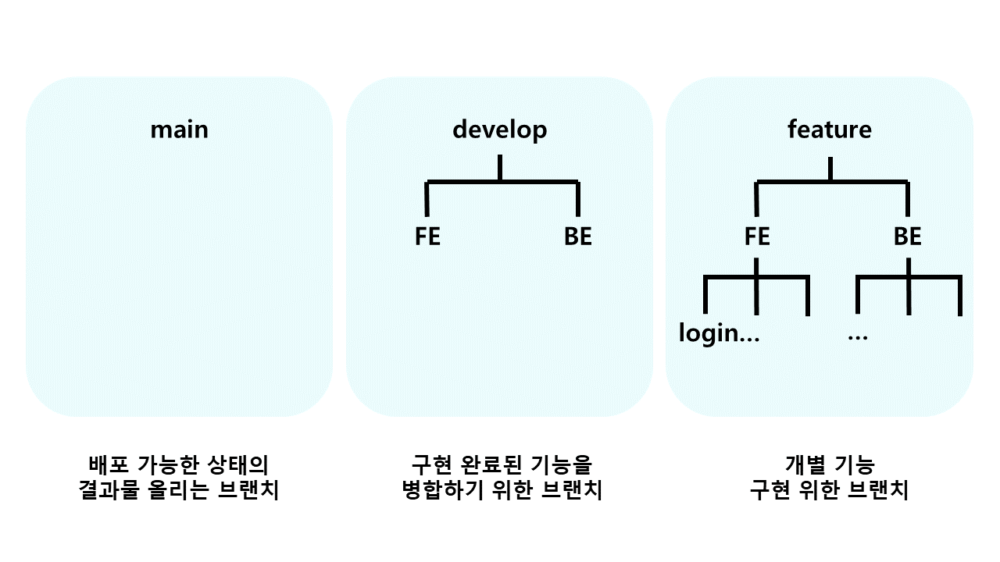

- `main`
  - 배포 가능한 상태의 결과물 올리는 브랜치
- `dev`
  - 구현 완료된 기능을 병합하기 위한 브랜치
  - 통합 폴더의 기능
- `feat`
  - 개별 기능 구현 브랜치
  - 기능 개발 완료 시 삭제
  - 네이밍 규칙
    - feature/FE or BE/기능이름
    - 예) feature/FE/login
        
- **feature 브랜치가 완성되면 develop 브랜치로 merge request를 통해 merge한다.** 
  ⇒ merge request가 요청되면, 모든 팀원들이 코드 리뷰를 하여 안전하게 merge한다.

 

## ✔ 프로젝트 산출물 

---

- [기능명세서 및 요구사항 명세서](https://docs.google.com/spreadsheets/d/1ORhAyYP_sGaXwou7e7pbeROBb1EwLq6k0hua8qWM9TE/edit#gid=0)
- [아키텍처](docs/images/architecture.png)
- [와이어프레임](https://www.figma.com/proto/rwMbAwmZPkt54BI3MRie6N/%EB%84%A4%EC%9D%B4%EB%B8%8C%EB%A3%A8?node-id=1212-1618&starting-point-node-id=1212%3A1618) 
- [API](https://documenter.getpostman.com/view/26249570/2s9Y5R1m6X)
- [ERD](docs/images/ERD.png) 
- [회의록](https://www.notion.so/wookdev/8408634b3a0044c8bfa6a6899015e6bb?v=dd2f346799f6490aaec4d346b881829d&pvs=4)

## 포팅 메뉴얼 
- [포팅메뉴얼](https://wookdev.notion.site/ab44cde17ec34f659ef8216d046a9334?pvs=4)

## ✔ 프로젝트 결과물

- [기획발표자료](https://www.canva.com/design/DAFrbMapsEo/4UPn_Rj0y7Y_4z8ZKB4axA/edit?utm_content=DAFrbMapsEo&utm_campaign=designshare&utm_medium=link2&utm_source=sharebutton)
- [중간발표자료](https://www.canva.com/design/DAFrbLSqKrU/v8Sp5kq6dnlUdGYDFqFfnQ/edit?utm_content=DAFrbLSqKrU&utm_campaign=designshare&utm_medium=link2&utm_source=sharebutton)
- [최종발표자료](https://www.canva.com/design/DAFqjZrSWQc/dZBUYNXj-oBvEQDHuIFKIw/edit?utm_content=DAFqjZrSWQc&utm_campaign=designshare&utm_medium=link2&utm_source=sharebutton) 

## 🎵 NeighBrew 서비스 화면
### 로그인

 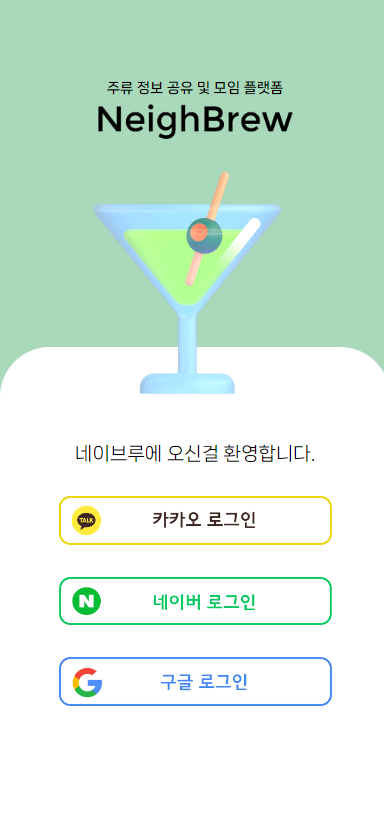

### 메인화면(술장)

 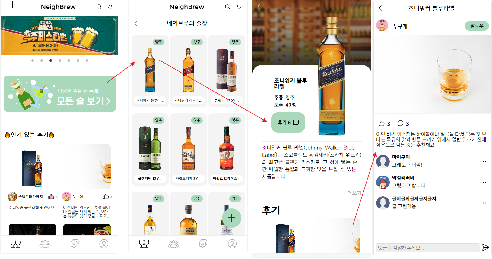
 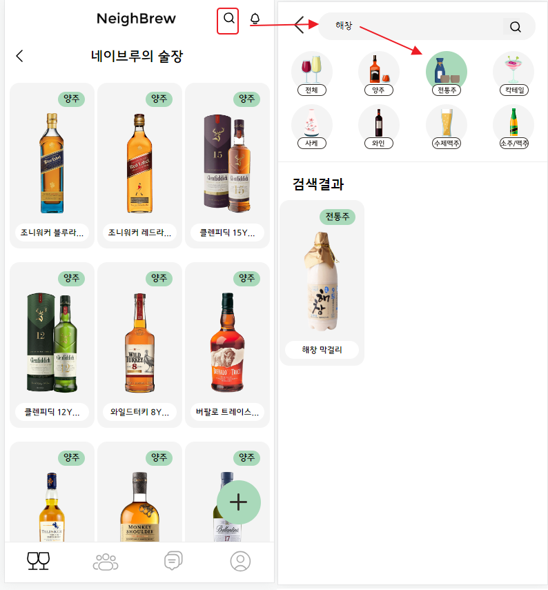

### 모임 등록

 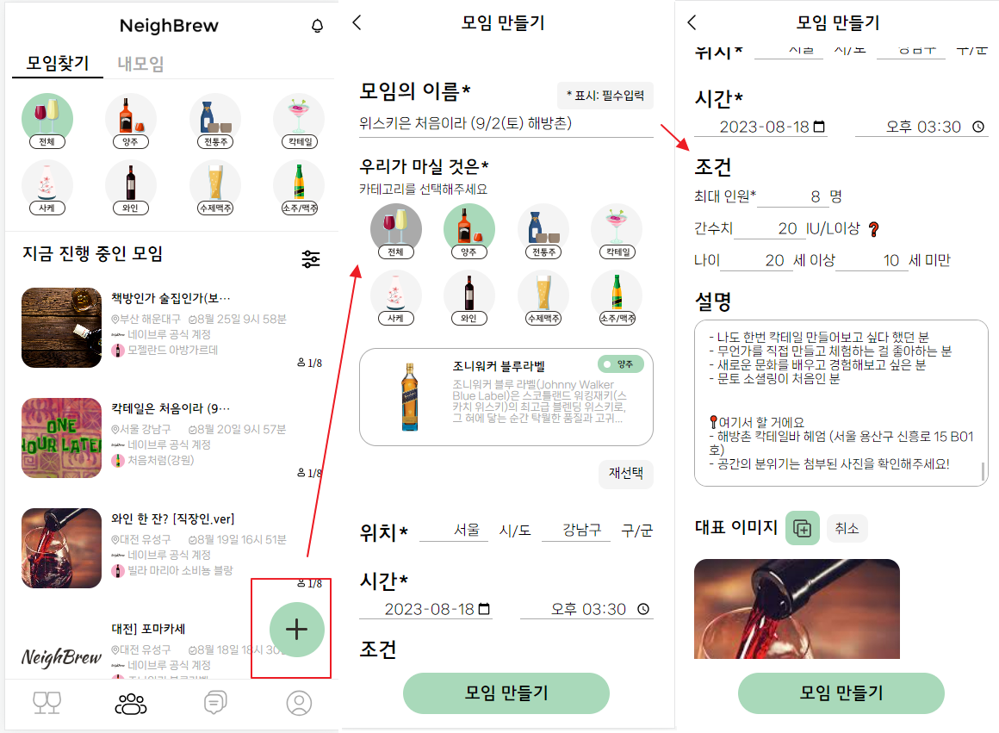

### 모임 참여
 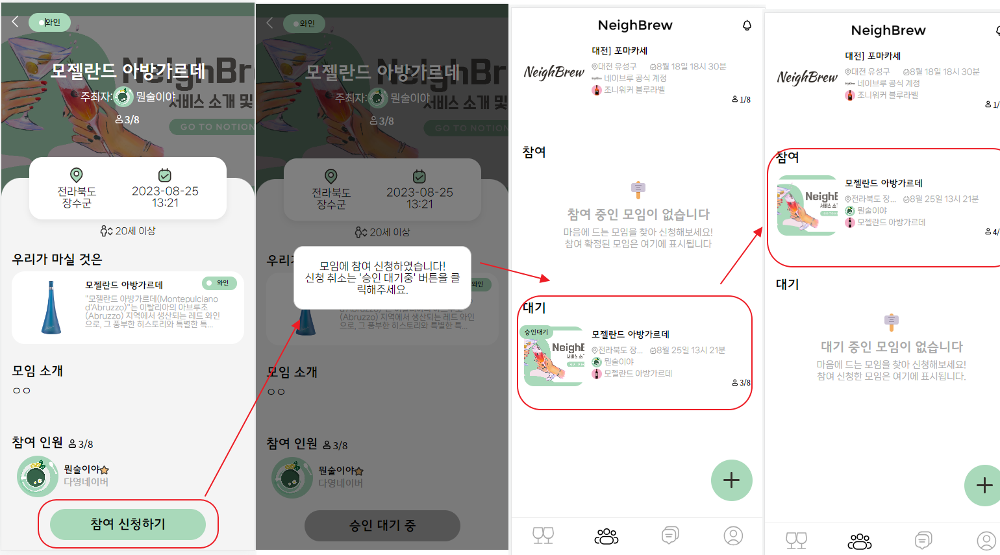

### 모임 관리 및 수정
 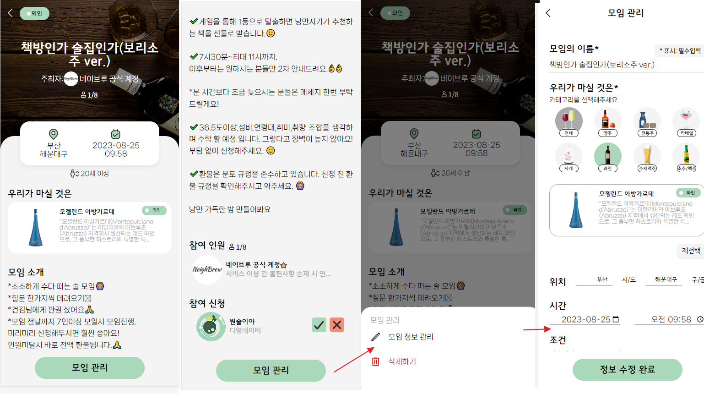

### 마이페이지
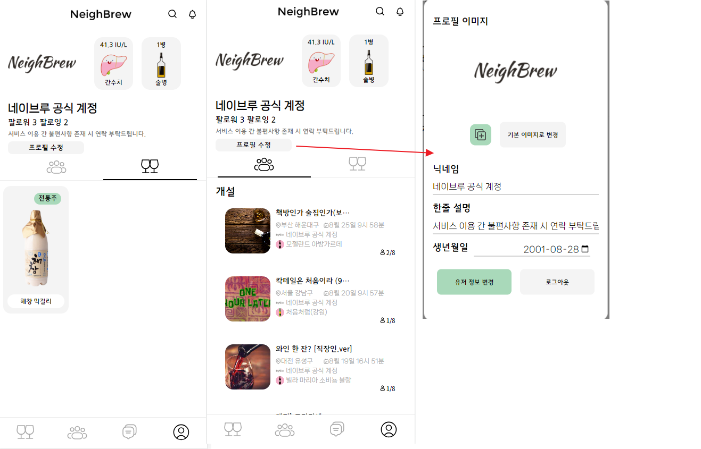

### 유저페이지
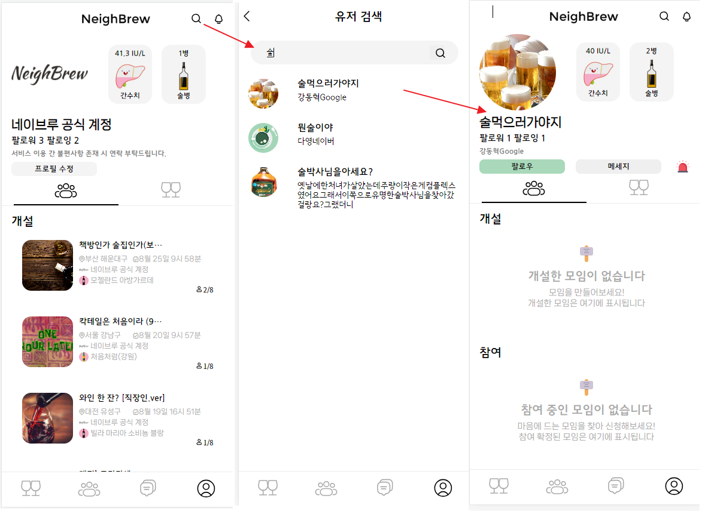

